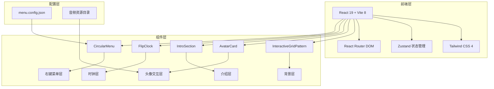
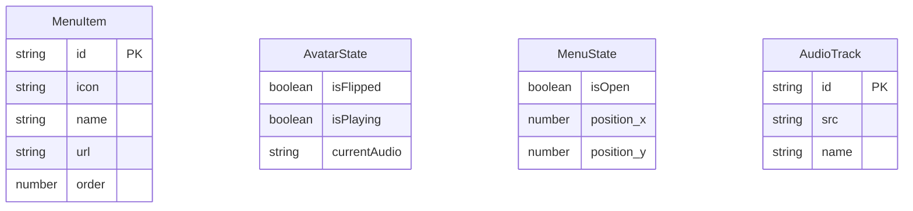

## 1. 架构设计



## 2. 技术说明

- **前端框架**：React 19 + TypeScript
- **构建工具**：Vite 8+
- **样式方案**：Tailwind CSS 4 + CSS Modules（组件级样式隔离）
- **状态管理**：Zustand（头像翻转状态、菜单开关状态、音频播放状态）
- **路由**：React Router DOM v7（单页应用，菜单导航）
- **图标**：lucide-react
- **初始化工具**：vite-init（react-ts 模板）
- **后端**：无（纯前端项目）
- **数据库**：无（配置通过JSON文件管理）

## 3. 路由定义

| 路由 | 用途 |
|------|------|
| / | 主页面，包含所有三层内容与交互功能 |

> 注：本项目为单页展示型网站，右键菜单中的跳转URL可配置为外部链接

## 4. API定义

不适用 - 纯前端项目，无后端API

## 5. 服务端架构图

不适用 - 纯前端项目

## 6. 数据模型

### 6.1 数据模型定义



### 6.2 配置文件定义

**菜单配置 (menu.config.json)**：
```json
[
  { "id": "home", "icon": "Home", "name": "首页", "url": "/", "order": 0 },
  { "id": "blog", "icon": "BookOpen", "name": "博客", "url": "/blog", "order": 1 },
  { "id": "projects", "icon": "FolderGit2", "name": "项目", "url": "/projects", "order": 2 },
  { "id": "about", "icon": "User", "name": "关于", "url": "/about", "order": 3 },
  { "id": "contact", "icon": "Mail", "name": "联系", "url": "/contact", "order": 4 },
  { "id": "github", "icon": "Github", "name": "GitHub", "url": "https://github.com", "order": 5 }
]
```

**音频资源**：存放于 `src/assets/audio/` 目录，支持动态扫描加载
